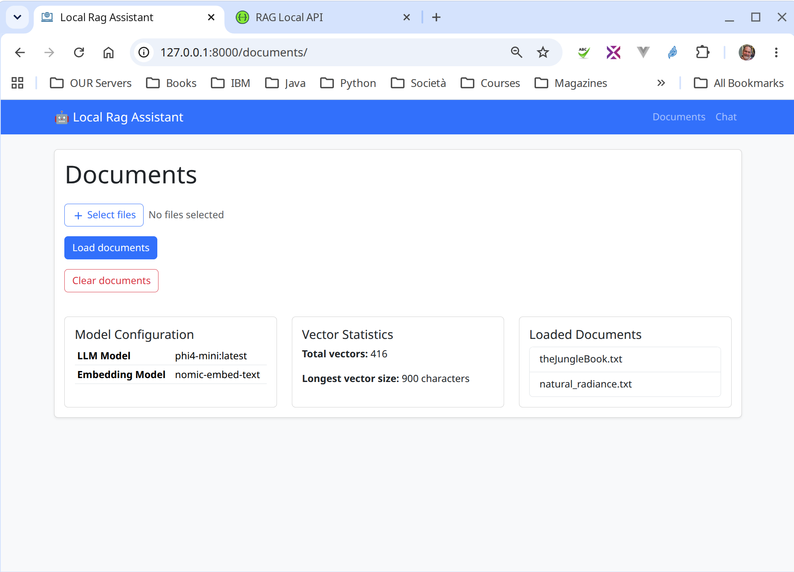
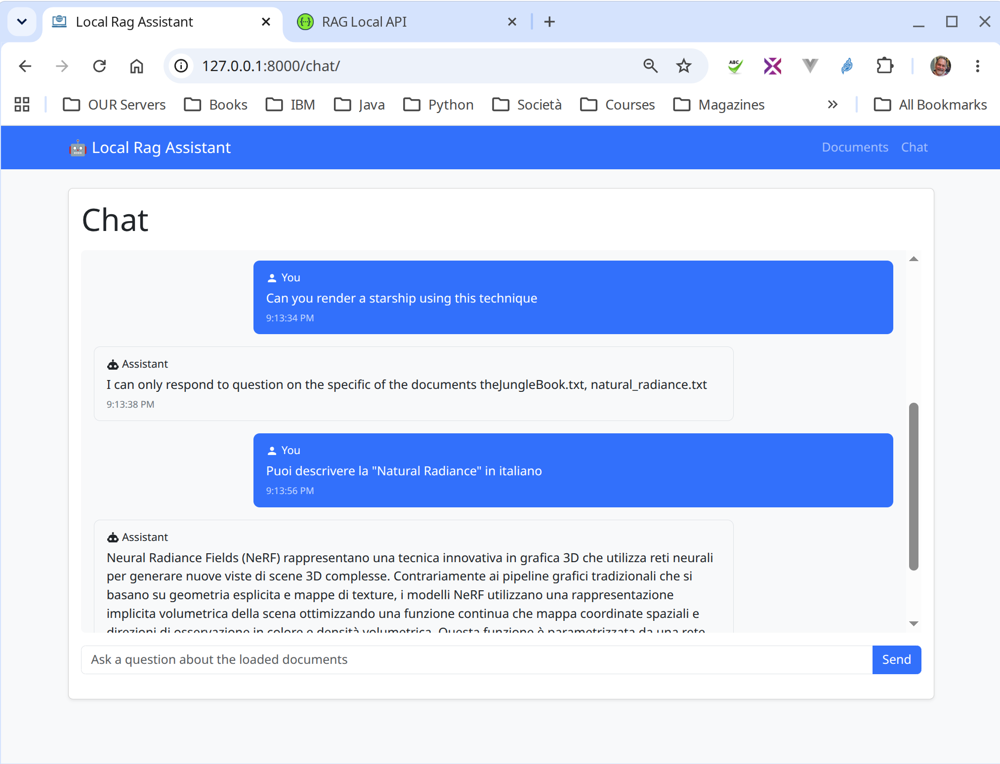

# rag-local

## Overview
rag-local is a lightweight Django project demonstrating how to build a Retrieval‑Augmented Generation (RAG) system that uses a local vector store and a local LLM (e.g., Ollama). It showcases chunking, embedding, and query answering via a REST API.

## Features

## Frontend

The project includes a simple HTML and Bootstrap only frontend that interacts with the API. It is automatically served by Django's static files handling and is reachable at `http://127.0.0.1:8000` once the server is running.

### Screenshots





The `docs/` folder contains sample documents that can be uploaded and queried during development.
- **Vector store** – FAISS index stored on disk (`rag_data`).
- **Chunking** – `services.chunk_text` splits documents into 900‑char chunks with 120‑char overlap. The chunk size and overlap are configurable via parameters, enabling experimentation and optimization.
- **Embeddings** – configurable embedding model; default `text-embedding` via Ollama.
- **LLM** – configurable reasoning model; default `llama3` via Ollama.  The local LLM engine exposes an OpenAI‑compatible API, allowing the client code to work with the local model.
- **REST API** – powered by Django REST Framework and Drf‑Spectacular.
- **CLI** – `rag_local:main` prints a friendly message.

## Prerequisites
- Python ≥3.12
- Docker (optional) for running Ollama locally.
- `uv` (or `pip`) to install dependencies.

## Installation
```bash
uv sync   # installs the dependencies listed in pyproject.toml
```

## Running the Project
```bash
uv run manage.py runserver
```
- The Chat page is available at `http://127.0.0.1:8000/chat`.
- Documentation interface to set up the RAG context is available `http://127.0.0.1:8000/documents`.
- The Schema is available at `http://127.0.0.1:8000/docs`.

## Using the API
- **Upload documents** – `POST /api/documents/` with `file` field (TXT for the time being).
- **Query** – `POST /api/chat/` with `question` field. The server returns the answer and supporting chunks.

Example with `curl`:
```bash
curl -F file=@example.txt http://127.0.0.1:8000/api/documents/
curl -X POST -d 'question=What is Python?' http://127.0.0.1:8000/api/chat/
```

## Local Vector Store
The data is stored under `rag_data/`.
The web interface is available on the same port as the API.

## Testing
```bash
uv run manage.py test
```

## Contributing
Feel free to open issues or pull requests. For major changes, create a draft first.

## License
MIT – see `LICENSE`.
